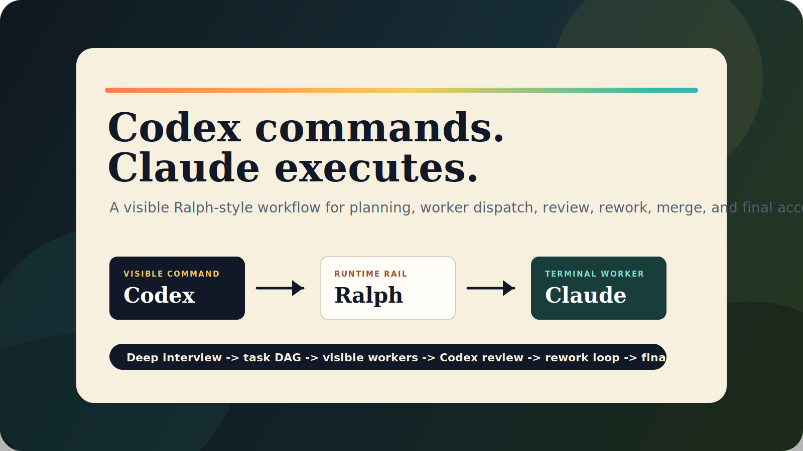
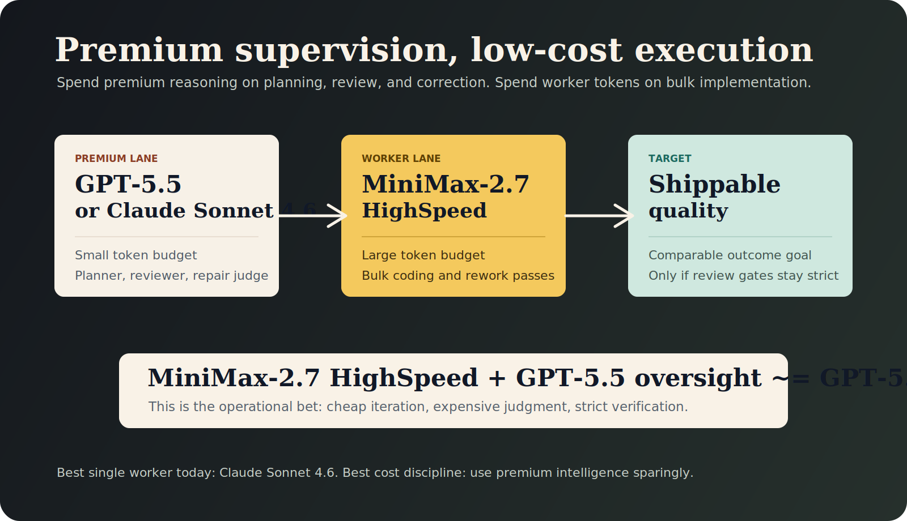
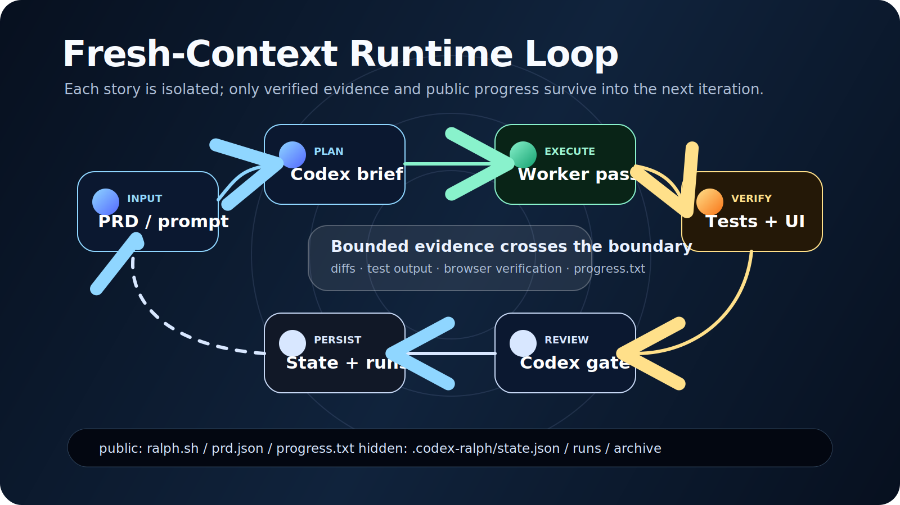

# Ralph 

Ralph is an autonomous AI agent loop. This repository recreates the original [snarktank/ralph](https://github.com/snarktank/ralph) source-repo shape, but fixes the runtime policy to:

- **Codex** as planner and reviewer
- **Claude Code** as worker
- **Playwright** as the primary browser verifier for UI stories

Each iteration is still a fresh story-level loop. Public memory persists through git history, `progress.txt`, and root `prd.json`. Internal state, archives, locks, and run artifacts live under `.codex-ralph/`.

**Amp is intentionally unsupported in this fork.**

## Model Economics

The point of this workflow is not "always use the smartest model for every token." The point is to spend a small amount of premium-model budget on decomposition, supervision, and review, then let cheaper execution models do the bulk of the implementation work.

- **Best default quality bar:** `Claude Sonnet 4.6`
- **Cheap worker option:** Claude can also be paired with other lower-cost coding models such as `MiniMax-2.7-Highspeed` for large-volume implementation passes
- **Operating thesis:** a small amount of premium oversight plus a large amount of cheap execution can reach roughly the same shipped quality as an all-premium loop, while using far fewer expensive tokens

In practice, this means you reserve premium reasoning for the parts that matter most:

- task slicing
- acceptance-criteria design
- diff review
- failure diagnosis
- final quality gates

And you push repetitive or high-volume code generation into the cheaper worker lane.



If you only care about absolute worker quality and not cost, `Claude Sonnet 4.6` is still the best fit for the worker role. Ralph exists for the opposite case: keep quality high while reducing how much premium-model spend is required to ship.

## Prerequisites

- `python3`
- `git`
- `codex` installed and authenticated
- `claude` installed and authenticated
- A git repository for the target project
- For UI stories: a repo-local browser verification command, preferably `npm run test:e2e`

## Setup

### Option 1: Use this repo as the source runtime

From this repo root:

```bash
./ralph.sh init --repo /absolute/path/to/your/project --prd-file ./prompt.md
./ralph.sh run --max-steps 3
```

If your target project already has a Ralph-style `prd.json`:

```bash
./ralph.sh init \
  --repo /absolute/path/to/your/project \
  --import-prd-json /absolute/path/to/your/project/prd.json
```

### Option 2: Copy the Ralph surface into another project

Copy the public workflow files:

```bash
ralph.sh
prompt.md
CLAUDE.md
prd.json.example
skills/
.claude-plugin/
flowchart/
```

The runtime is still driven by `orchestrator.py`, but normal usage should go through `./ralph.sh`.

### Browser verification setup

For UI stories, initialize with a Playwright command:

```bash
./ralph.sh init \
  --repo /absolute/path/to/your/project \
  --prd-file ./prompt.md \
  --browser-verify-command "npm run test:e2e"
```

Recommended pattern:

- Put the target repo's UI smoke coverage behind `npm run test:e2e`
- Keep Playwright specs repo-local
- Use Python/HTTP smoke scripts only as backup diagnostics

## Workflow

### 1. Write the task prompt or import a PRD

You can start from:

- `prompt.md`
- a markdown PRD passed via `--prd-file`
- a Ralph-compatible `prd.json` passed via `--import-prd-json`

### 2. Initialize Ralph state

```bash
./ralph.sh init --repo /absolute/path/to/project --prd-file ./prompt.md
```

This creates or refreshes:

- root `prd.json`
- root `progress.txt`
- hidden runtime state in `.codex-ralph/`

### 3. Run the loop

```bash
./ralph.sh
./ralph.sh --tool claude
./ralph.sh run --max-steps 5 --max-retries 1
```

Ralph will:

1. Read root `prd.json`
2. Pick the next dependency-ready story where `passes: false`
3. Ask Codex to produce a compact execution brief
4. Ask Claude Code to implement that single story
5. Run local tests and optional Playwright verification
6. Ask Codex to review deterministic evidence
7. Mark `prd.json` and `.codex-ralph/state.json`
8. Append learnings to `progress.txt`
9. Commit on pass unless `--no-commit` is set
10. Repeat until all stories pass or the step limit is reached

## Key Files

| File | Purpose |
|------|---------|
| `ralph.sh` | Primary user entrypoint with Ralph-style command ergonomics |
| `orchestrator.py` | Internal Python runtime for planning, worker execution, review, locking, and state export |
| `prompt.md` | Default task prompt entry |
| `CLAUDE.md` | Worker instruction template used to brief Claude Code |
| `prd.json` | Public Ralph-compatible task list with `passes` flags |
| `prd.json.example` | Minimal example PRD format |
| `progress.txt` | Append-only public progress log |
| `.codex-ralph/state.json` | Hidden canonical state with `status`, `attempt_count`, and `last_run_id` |
| `.codex-ralph/runs/` | Stored briefs, worker results, test evidence, and review outputs |
| `.codex-ralph/archive/` | Archived prior runs and migrated legacy state |
| `browser_verify.py` | Structured browser verifier wrapper for repo-local commands |
| `skills/` | Ralph-compatible skill documentation for Codex commander and Claude worker |
| `.claude-plugin/` | Claude plugin metadata for discovery and packaging shape |
| `flowchart/` | Source flowchart assets for the runtime loop |

## Flowchart



The source loop definition lives in [flowchart/loop.mmd](flowchart/loop.mmd).

## Critical Concepts

### Each iteration = fresh context

Every story run is a fresh planner/worker/reviewer cycle. Durable memory comes from:

- git history
- `progress.txt`
- root `prd.json`
- hidden `.codex-ralph/state.json`

### Public state outside, enhanced state inside

Users see the Ralph-style public files at repo root. The richer truth stays hidden:

- root `prd.json` keeps `branchName`, `userStories`, and `passes`
- `.codex-ralph/state.json` keeps explicit `status`, retries, and run IDs

### Small stories still matter

This fork is more defensive than the shell loop, but it still depends on small PRD items. Good stories fit one worker pass and one evidence review. Bad stories force huge prompts, weak verification, and unstable retries.

### Browser verification is first-class

This fork does **not** preserve the original `dev-browser` façade. UI verification is surfaced directly as browser verification with Playwright-style commands.

UI story behavior:

- browser verifier configured and passing: story may pass
- browser verifier configured and failing: story is blocked
- browser verifier missing for a UI story: story is blocked

### AGENTS.md updates are controlled

If the target repo has `AGENTS.md`, Claude should only update it when the current story reveals a durable repo convention or gotcha. Otherwise it must leave the file untouched.

### Deterministic evidence beats worker claims

Reviewer decisions are based on:

- worker structured output
- local test output
- repo diff evidence
- browser verification results
- current story acceptance criteria

## Example Case Study

The repository includes one worked example of this loop driving a real target repo:

- [CityGenius subscription + payment test](docs/citygenius-subscription-payment-test.md)

That document shows how the fork was used to wire a copied Astro blog into a Stripe subscription skeleton with Playwright verification.

## Debugging

Check public progress:

```bash
cat prd.json
cat progress.txt
```

Check runtime health:

```bash
./ralph.sh status
./ralph.sh doctor
```

Inspect internal evidence:

```bash
find .codex-ralph/runs -type f | sort | tail -n 20
cat .codex-ralph/state.json
```

## Tool Policy

- `--tool claude` is supported
- `--tool amp` fails fast with an explicit explanation
- the command surface stays Ralph-like, but the runtime policy is fixed to Codex commander + Claude worker

## Archiving

When you re-initialize against a different `branchName`, Ralph archives prior runtime state under `.codex-ralph/archive/`.

If this repo previously used the legacy `state/` layout, the runtime migrates it into `.codex-ralph/archive/legacy-state/`.

## References

- [snarktank/ralph](https://github.com/snarktank/ralph)
- [Geoffrey Huntley's Ralph article](https://ghuntley.com/ralph/)
- [Claude Code documentation](https://docs.anthropic.com/en/docs/claude-code)
- [Playwright documentation](https://playwright.dev/)
