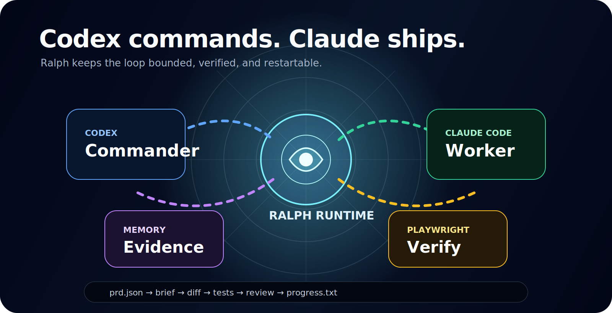
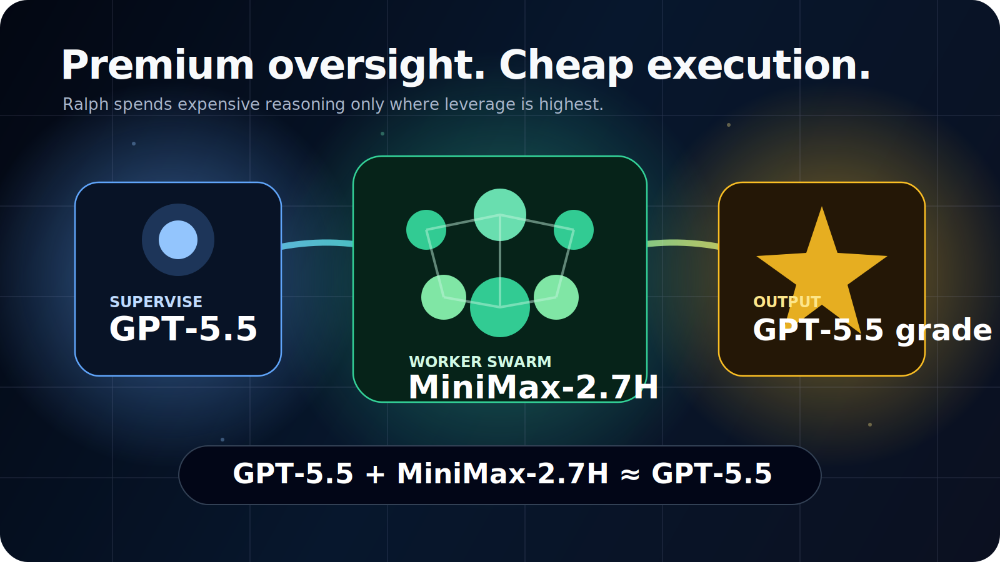
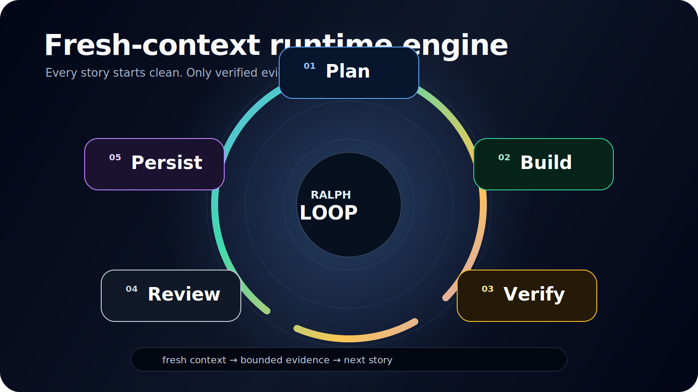

# codex-claude-ralph

`codex-claude-ralph` 是一个通用、可安装的 Codex workflow skill。v10 的定位是：

- Codex 在当前对话里做 planner / scheduler / reviewer / final judge
- Claude CLI 只做可见终端 worker
- Ralph runtime 负责状态、文件通信、worktree、事件、可见启动、合并和 handoff 记录

它不是全面接管 Codex 的平台。它只在用户明确触发 `$codex-claude-ralph` 或 `/use codex-claude-ralph` 时介入。



## Why

这个工作流的意义是用少量高级模型 token 做规划、监督和审核，用大量 worker token 做执行性开发，并通过返工闭环保持交付质量。

默认最佳 worker 质量仍然是 `Claude Sonnet 4.6`。Claude 也可以接入更便宜的执行模型，例如 `MiniMax-2.7-HighSpeed`，用于大批量实现工作。核心思想不是替代最强模型，而是让高端模型花在最值得的地方。



## v10 Flow

1. 用户给任务、bug 或功能目标。
2. Codex 只读探索仓库事实。
3. 若需求模糊，Codex 按 oh-my-codex 风格每轮只问一个高杠杆问题。
4. 每轮 discussion 同时展示完整 `epistemic / deontic / dialectical` scorecard。
5. readiness 通过后，Codex 生成并展示任务 DAG、依赖、并行批次、写范围和验证计划。
6. 用户确认任务图后才开始执行。
7. Runtime 为每个任务创建独立 git worktree 和 branch。
8. Runtime 通过 macOS `Terminal.app` 拉起 Claude CLI，可见运行，同时写 artifact。
9. Codex 在当前对话里读取 diff、worker 输出、测试和 Playwright 证据并审核。
10. 审核不通过则写返工 brief，再拉起 Claude。每个任务最多自动返工 3 次。
11. 3 次后仍不通过，用户选择继续 Claude 或让当前 Codex/GPT 接手。
12. 所有任务合并后，Codex 执行最终全面审核，通过才交付。



## Install

全局安装：

```bash
./install/install.sh global
```

项目局部安装：

```bash
./install/install.sh project --repo /absolute/path/to/repo
```

检查安装和依赖：

```bash
./install/doctor.sh --repo /absolute/path/to/repo
```

## Stable Commands

状态和需求对齐：

```bash
runtime/ralph.sh status --repo /absolute/path/to/repo --json
runtime/ralph.sh answer --repo /absolute/path/to/repo --choice A --note "..." --language zh
```

任务图和 worker：

```bash
runtime/ralph.sh plan --repo /absolute/path/to/repo --task-graph /path/to/task_graph.json
runtime/ralph.sh launch --repo /absolute/path/to/repo --task-id T1 --run-id run-id --visible-terminal
runtime/ralph.sh collect --repo /absolute/path/to/repo --task-id T1 --run-id run-id
```

审核、合并和 handoff：

```bash
runtime/ralph.sh review-mark --repo /absolute/path/to/repo --task-id T1 --verdict passed --review /path/to/review.json
runtime/ralph.sh merge --repo /absolute/path/to/repo --task-id T1 --run-id run-id
runtime/ralph.sh handoff --repo /absolute/path/to/repo --mode continue_claude_rework
runtime/ralph.sh handoff --repo /absolute/path/to/repo --mode codex_takeover
```

Playwright：

```bash
runtime/ralph.sh playwright --repo /absolute/path/to/repo --task-id T1 --url http://127.0.0.1:3000
```

旧入口仍保留：

```bash
runtime/scripts/ralph-skill-run.sh --repo /absolute/path/to/repo --goal-spec /absolute/path/to/repo/.codex-ralph/goal_spec.json --max-steps 5
```

## File Communication

所有状态和通信文件写入目标 repo 的 `.codex-ralph/`：

```text
.codex-ralph/
  state.json
  events.jsonl
  goal_spec.json
  scorecard.json
  task_graph.json
  integration.json
  runs/<run_id>/tasks/<task_id>/
    task.json
    brief.md
    claude_prompt.md
    worker_output.json
    worker_raw.log
    diff.patch
    tests.json
    playwright.json
    review.json
    rework_brief.md
    rework_history.json
  worktrees/<run_id>/<task_id>/
  playwright/
    <task_id>.spec.ts
    final.spec.ts
    screenshots/
    traces/
```

`status --json` 暴露：

- `stage`
- `status`
- `message`
- `scorecard`
- `task_graph`
- `current_batch`
- `active_workers`
- `review_queue`
- `rework_summary`
- `handoff_options`
- `events_path`
- `next_action`

## Review Rules

Codex review 固定维度：

- `requirements_fit`
- `acceptance_coverage`
- `scope_compliance`
- `verification_evidence`
- `integration_risk`
- `ux_or_runtime_quality`

Claude 自报成功不等于完成。Codex 必须读取 worker 输出、diff、测试结果、Playwright 结果和验收标准，再通过 `review-mark` 写入 verdict。

UI / browser / canvas / 3D / visualization / interaction 任务必须有 Playwright 证据。缺少证据时 review 应阻断。

## Skill Display

Codex Desktop 可能把 skill 显示为 `{package}:{display_name}`。本仓库安装目录仍保持 `codex-claude-ralph`，但 UI 显示名使用 `Workflow`，避免出现 `Codex Claude Ralph: Codex Claude Ralph` 这种重复标题。

触发名不变：

```text
$codex-claude-ralph
/use codex-claude-ralph
```

## Verification

自动化覆盖包含：

- install global/project
- doctor
- status/answer 旧接口
- task graph plan/status
- visible-terminal launch command
- git worktree creation
- collect/review-mark/handoff
- Playwright spec generation
- worker adapter success/blocked/invalid JSON/timeout/non-zero
- hook config validation
